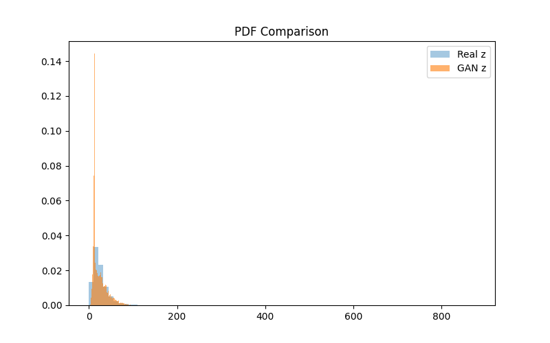
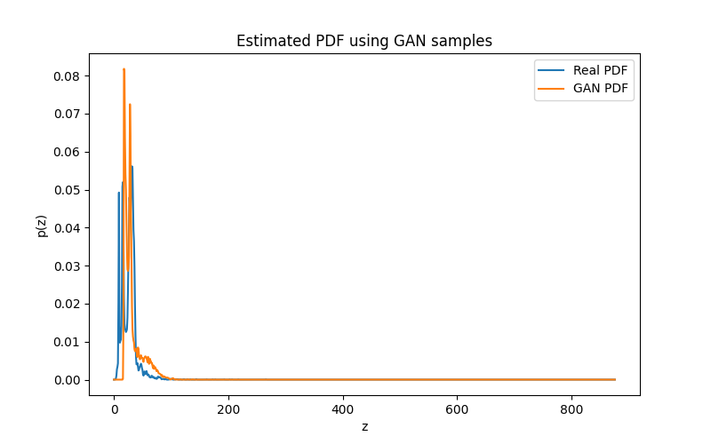

# Probability-Density-Functions-using-data-only

## Overview
This project focuses on learning the unknown probability density function (PDF) of air quality data, specifically Nitrogen Dioxide (NO2) levels.

Instead of assuming a standard distribution like Gaussian or Exponential, I used a Generative Adversarial Network (GAN). The model learns to generate synthetic data that mathematically matches the distribution of the real transformed data.

## Dataset
- File: data.csv
- Column Used: no2
- Preprocessing: Rows with missing or non-numeric values were removed to ensure stability.

## Methodology

### 1. Data Transformation
The original NO2 values (x) were transformed into a new variable (z) using a sinusoidal function. The transformation parameters were derived dynamically from the university roll number to ensure a unique distribution.

Formula:
z = x + a_r sin(b_r x)

Transformation Parameters (derived from Roll No: 102303706):
- a_r: 0.5
- b_r: 0.6

### 2. GAN Architecture
To estimate the PDF, I implemented a GAN with two competing neural networks:

- Generator (G): Takes random noise as input and tries to create "fake" data samples that look like the transformed z values.
- Discriminator (D): Tries to distinguish between the "Real" z data and the "Fake" data from the Generator.

Both networks were trained simultaneously for 3000 epochs until they reached a stable state.

## Results
The model converged successfully. The loss values indicate that the Generator is producing data indistinguishable from the real distribution.

- Final Discriminator Loss: 1.3827 (Stable)
- Final Generator Loss: 0.7042 (Stable)

## Visualization
The graphs below demonstrate the performance of the GAN.

### 1. Histogram Comparison
The overlap between the Real Data (Blue) and GAN Generated Data (Orange) shows that the model successfully captured the data density.

### 2. KDE (Probability Density Function)
The Kernel Density Estimation (KDE) plot confirms that the estimated PDF closely follows the real distribution curve.

